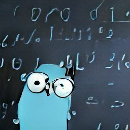

# gosymbol

`gosymbol` is a Go package for performing symbolic computations. Its main purpouse is to be educational and to give me a chance to dive into the inner workings of symbolic computations and computer algebra systems. The development journey will be published as a series of [Medium articles](https://medium.com/@victor.w.brun). 

The disturbing package image is generated by [DALL·E](https://huggingface.co/spaces/dalle-mini/dalle-mini).

## References
The below listed references are used during the development process to deepen my knowladge about the subject of symbolic computation systems.
- COHEN, Joel S. *Computer algebra and symbolic computation: Mathematical methods*. AK Peters/CRC Press, 2003.
- The course *Domain-Specific Languages of Mathematics* at Chalmers University of Technology. [Github repo](https://github.com/DSLsofMath/DSLsofMath).
